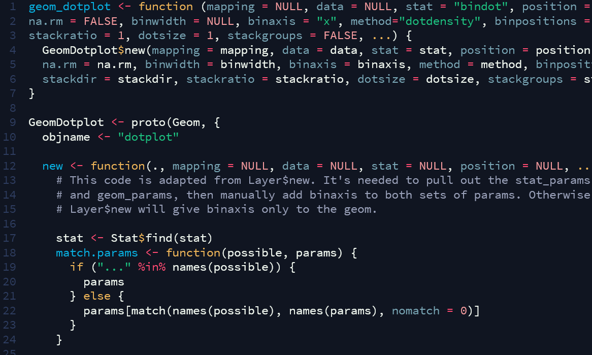

# Kosmosepralle:sparkles:
An RStudio theme, available as `tmTheme` 

## How to install
1. Download the theme: `Right click -> Save Link As...` will work fine.
2. Go to Rstudio: `Tools -> Global Options -> Appearance -> Add Theme`. 
3. When you've added the theme, select it from the list of themes and click apply. 

:rocket:Enjoy.
